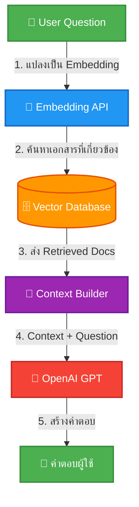

## Next.js 16: AI-Native Developer Masterclass - Day 7

### พัฒนา Chatbot API ด้วยเทคนิค RAG (Retrieval-Augmented Generation)

0. [Section 0: ทบทวน RAG Architecture](#section-0-ทบทวน-rag-architecture)
    - ทบทวน Vector Database และ Similarity Search จาก Day 6
    - ทำความเข้าใจ RAG Pipeline ทั้งระบบ

1. [Section 1: RAG Service Architecture](#section-1-rag-service-architecture)
    - สร้าง Service สำหรับเชื่อมต่อ OpenAI และ Vector Store
    - การออกแบบ RAG Pipeline
    - Prompt Engineering สำหรับ RAG

2. [Section 2: Context Management](#section-2-context-management)
    - เทคนิคการดึงเอกสารจาก Vector Database
    - การสร้าง Context Window ที่มีประสิทธิภาพ
    - การจัดการ Token Limit

3. [Section 3: Chat API Endpoint](#section-3-chat-api-endpoint)
    - พัฒนา REST API สำหรับรับคำถามและส่งคืนคำตอบ
    - การทำ Streaming Response
    - Workshop: ทดสอบ Chat API

4. [Section 4: Chat History & Memory](#section-4-chat-history--memory)
    - การจัดการบริบทการสนทนาต่อเนื่อง
    - Database Schema สำหรับ Chat History
    - การนำ History มาใช้ใน RAG

5. [Section 5: Error Handling & Optimization](#section-5-error-handling--optimization)
    - การจัดการข้อผิดพลาดในระบบ AI API
    - Rate Limiting และ Retry Logic
    - Workshop: ทดสอบความเสถียรของระบบ

6. [Section 6: Chat Widget UI](#section-6-chat-widget-ui)
    - การสร้าง Floating Chat Button
    - การสร้างหน้าต่างสนทนา (Chat Window)
    - Styling ด้วย Tailwind CSS

7. [Section 7: Frontend Integration](#section-7-frontend-integration)
    - เชื่อมต่อ UI เข้ากับ Chat API
    - การจัดการสถานะ Loading และ Streaming
    - การแสดงผลแบบ Real-time (Typewriter Effect)

8. [Section 8: Knowledge Base Management](#section-8-knowledge-base-management)
    - Database Schema สำหรับ Knowledge Documents
    - API Routes (CRUD + File Upload)
    - Knowledge Base UI (Sidebar + Document Detail)
    - File Upload สำหรับ PDF, CSV, TXT
    - เชื่อมต่อกับ Ingestion Pipeline
    - Ingestion Library สำหรับใช้ใน API และ Script
    - Custom Modal Dialogs (Delete Confirmation + Index Success)

---

### Section 0: ทบทวน RAG Architecture

#### 0.1 RAG คืออะไร?

**RAG (Retrieval-Augmented Generation)** คือเทคนิคที่ทำให้ AI Model (เช่น GPT) สามารถตอบคำถามจากข้อมูลเฉพาะทางที่เราเตรียมไว้ แทนที่จะตอบจากความรู้ทั่วไป

**กระบวนการทำงาน:**
```
ผู้ใช้ถามคำถาม → [1] แปลงเป็น Embedding
                 → [2] ค้นหาเอกสารที่เกี่ยวข้อง (Similarity Search)
                 → [3] นำเอกสารมาประกอบเป็น Context
                 → [4] ส่ง Context + คำถาม ให้ AI ตอบ
                 → [5] ส่งคำตอบกลับผู้ใช้
```

**Flow Diagram:**



**ทำไม RAG ถึงดีกว่า Fine-tuning?**

| | RAG | Fine-tuning |
|---|---|---|
| **ข้อมูลใหม่** | อัปเดตได้ทันที | ต้อง train ใหม่ |
| **ค่าใช้จ่าย** | ต่ำ (ใช้ embedding) | สูง (ต้อง GPU) |
| **ความแม่นยำ** | สูง (มี source อ้างอิง) | ปานกลาง |
| **Data Privacy** | ข้อมูลอยู่ใน DB ของเรา | ข้อมูลอาจหลุด |

---

### Section 1: RAG Service Architecture

#### 1.1 สร้าง RAG Service

สร้างไฟล์ `lib/rag-service.ts`:

```typescript
import { openai } from "@/lib/openai"
import { searchDocuments, SearchResult } from "@/lib/vector-search"

// กำหนดโครงสร้างของข้อความในแชท
export interface ChatMessage {
  role: "system" | "user" | "assistant"
  content: string
}

// โครงสร้างของคำตอบที่ฟังก์ชัน RAG จะส่งกลับ
export interface RAGResponse {
  answer: string
  sources: SearchResult[]
  tokensUsed: number
}

// System Prompt สำหรับ RAG Chatbot
const SYSTEM_PROMPT = `คุณคือ AI Assistant ของร้าน Smart Electronic Thailand ร้านค้าอุปกรณ์เสริมสมาร์ทโฟนออนไลน์
คุณมีหน้าที่ตอบคำถามจากข้อมูลร้านค้า สินค้า และ FAQ เท่านั้น

กฎการทำงาน:
1. ตอบคำถามโดยอ้างอิงจากข้อมูลที่ให้เท่านั้น (Context)
2. ถ้าข้อมูลไม่เพียงพอ ให้ตอบว่า "ขออภัย ไม่พบข้อมูลที่เกี่ยวข้องกับคำถามนี้ในระบบของร้าน"
3. ตอบเป็นภาษาไทยเสมอ ยกเว้นศัพท์เทคนิค
4. ตอบอย่างกระชับและตรงประเด็น
5. ถ้ามีข้อมูลจากหลายแหล่ง ให้สรุปรวมกัน
6. ถ้าถามเรื่องสินค้า ให้แนะนำรหัสสินค้า ชื่อ ราคา และรายละเอียดสั้นๆ

คุณจะได้รับข้อมูลจากเอกสารร้านค้าในส่วน <context> ด้านล่าง`

export async function generateRAGResponse(
  userMessage: string,
  chatHistory: ChatMessage[] = [],
  topK: number = 5
): Promise<RAGResponse> {
  // 1. ค้นหาเอกสารที่เกี่ยวข้อง
  const searchResults = await searchDocuments(userMessage, topK)

  // 2. สร้าง Context จากผลการค้นหา
  const context = searchResults
    .map((doc, i) => `[เอกสาร ${i + 1}] (แหล่งที่มา: ${doc.metadata?.source || "N/A"}, ความเกี่ยวข้อง: ${Math.round(doc.similarity * 100)}%)\n${doc.content}`)
    .join("\n\n---\n\n")

  // 3. สร้าง Messages สำหรับ OpenAI
  const messages: ChatMessage[] = [
    {
      role: "system",
      content: SYSTEM_PROMPT,
    },
    // เพิ่ม Chat History (จำกัด 10 messages ล่าสุด)
    ...chatHistory.slice(-10),
    {
      role: "user",
      content: `<context>\n${context}\n</context>\n\nคำถาม: ${userMessage}`,
    },
  ]

  // 4. เรียก OpenAI Chat API
  const completion = await openai.chat.completions.create({
    model: "gpt-4o-mini",
    messages,
    temperature: 0.3, // ต่ำ = ตอบตรงประเด็น, สูง = ตอบหลากหลาย
    max_tokens: 1000,
  })

  const answer = completion.choices[0]?.message?.content || "ไม่สามารถสร้างคำตอบได้"

  return {
    answer,
    sources: searchResults,
    tokensUsed: completion.usage?.total_tokens || 0,
  }
}
```
> System Prompt คือหัวใจของ RAG เพราะมันกำหนดบทบาทและกฎการตอบของ AI ให้ชัดเจน เพื่อให้ได้คำตอบที่ตรงกับความต้องการของร้านค้า
> System Prompt ที่ดีจะช่วยลดปัญหา Hallucination และทำให้คำตอบมีความน่าเชื่อถือมากขึ้น

**อธิบายโค้ด:**
- เราสร้าง `generateRAGResponse` ฟังก์ชันที่รับคำถามของผู้ใช้และประวัติการสนทนา
- ฟังก์ชันจะค้นหาเอกสารที่เกี่ยวข้องจาก Vector Database และ
สร้าง Context สำหรับ AI
- เราส่ง Context และคำถามไปให้ OpenAI เพื่อสร้างคำตอบ


#### 1.2 ทำความเข้าใจ Prompt Engineering สำหรับ RAG

**หลักการออกแบบ System Prompt:**

1. **กำหนดบทบาท** — บอก AI ว่าเป็นอะไร (เช่น AI Assistant ของร้าน Smart Electronic Thailand)
2. **กำหนดขอบเขต** — ตอบจากข้อมูลที่ให้เท่านั้น
3. **กำหนดกฎ** — ถ้าไม่รู้ให้ตอบว่าไม่รู้ (ไม่ hallucinate)
4. **กำหนดรูปแบบ** — ภาษา, ความยาว, รูปแบบการตอบ

```typescript
// ตัวอย่าง Prompt ที่ดี — กำหนดบทบาท + ขอบเขต + กฎชัดเจน
const GOOD_PROMPT = `
คุณคือ AI ผู้ช่วยร้าน Smart Electronic Thailand (ร้านขายอุปกรณ์เสริมสมาร์ทโฟน)
ตอบเฉพาะข้อมูลจาก <context> เช่น ข้อมูลสินค้า (เคส, ฟิล์ม, สายชาร์จ), FAQ, ข้อมูลร้านค้า
ถ้าไม่รู้ ให้ตอบว่าไม่มีข้อมูลในระบบ
ถ้าถามเรื่องสินค้า ให้ระบุรหัส (P001-P010) ชื่อ ราคา
`

// ตัวอย่าง Prompt ที่ไม่ดี — ไม่มีบทบาท ไม่มีขอบเขต
const BAD_PROMPT = `
ตอบคำถามครับ
`
```

**ทดสอบ RAG Service:**
สร้างไฟล์ `scripts/test-rag-service.ts`:

```typescript
import { generateRAGResponse } from "@/lib/rag-service"

async function main() {
  const question = "วิธีการสั่งซื้อสินค้า?"
  const response = await generateRAGResponse(question, [])
  console.log("Answer:", response.answer)
  console.log("Sources:", response.sources.map(s => s.metadata?.source))
}

main().catch(console.error)
```

**รันสคริปต์:**
```bash
npx tsx --env-file=.env scripts/test-rag-service.ts
```

**ผลลัพธ์:**
```
Answer: ลูกค้าสามารถสั่งซื้อสินค้าได้ง่ายๆ ผ่านหน้าเว็บไซต์ โดยทำตามขั้นตอนดังนี้:
1. เลือกสินค้าที่ชอบและใส่ตะกร้า
2. กดชำระเงิน (อย่าลืมล็อกอินเพื่อรับส่วนลด 10%)
3. แจ้งโอนเงินหรือเลือกชำระด้วยบัตรเครดิต
4. รอรับของที่บ้านได้เลยครับ
Sources: [
  'CustomerFAQ.pdf',
  'CustomerFAQ.pdf',
  'CustomerFAQ.pdf',
  'CustomerFAQ.pdf',
  'CustomerFAQ.pdf'
]
```


---

### Section 2: Context Management

#### 2.1 การดึงเอกสารอย่างมีประสิทธิภาพ

สร้างไฟล์ `lib/context-builder.ts`:

```typescript
import { SearchResult } from "./vector-search"

export interface ContextConfig {
  maxTokens?: number        // จำกัด token สำหรับ context
  minSimilarity?: number    // ค่า similarity ขั้นต่ำ
  maxDocuments?: number     // จำกัดจำนวนเอกสาร
}

export function buildContext(
  documents: SearchResult[],
  config: ContextConfig = {}
): string {
  const {
    maxTokens = 3000,
    minSimilarity = 0.5,
    maxDocuments = 5,
  } = config

  // 1. กรองเอกสารที่ similarity ต่ำเกินไป
  const relevantDocs = documents.filter(
    (doc) => doc.similarity >= minSimilarity
  )

  // 2. จำกัดจำนวนเอกสาร
  const limitedDocs = relevantDocs.slice(0, maxDocuments)

  // 3. สร้าง Context พร้อมจำกัด token
  let context = ""
  let estimatedTokens = 0

  for (const doc of limitedDocs) {
    // ประมาณ token (1 token ≈ 4 ตัวอักษรภาษาอังกฤษ, 1-2 ตัวอักษรภาษาไทย)
    const docTokens = Math.ceil(doc.content.length / 2)

    if (estimatedTokens + docTokens > maxTokens) break

    context += `[แหล่งที่มา: ${doc.metadata?.source || "N/A"}]\n${doc.content}\n\n---\n\n`
    estimatedTokens += docTokens
  }

  return context.trim()
}
```
**อธิบายโค้ด:**
- ฟังก์ชัน `buildContext` จะรับเอกสารที่ค้นหาได้และ config สำหรับการจัดการ context
- เรากรองเอกสารที่มีความเกี่ยวข้องต่ำเกินไป และจำกัดจำนวนเอกสารที่นำมาใช้
- เราประมาณจำนวน token ที่จะใช้จากความยาวของเอกสาร และหยุดเมื่อเกิน limit ที่กำหนด

**ทดสอบ Context Builder:**
สร้างไฟล์ `scripts/test-context-builder.ts`:

```typescript
import { buildContext } from "@/lib/context-builder"

async function main() {
  const mockDocuments = [
    {
      id: "1",
      content: "วิธีการสั่งซื้อสินค้า? คุณสามารถสั่งซื้อผ่านเว็บไซต์...",
      metadata: { source: "CustomerFAQ.pdf" },
      similarity: 0.82,
    },
    {
      id: "2",
      content: "นโยบายการคืนสินค้า? ลูกค้าสามารถคืนสินค้าได้ภายใน 7 วัน...",
      metadata: { source: "CustomerFAQ.pdf" },
      similarity: 0.75,
    },
    {
      id: "3",
      content: "เวลาทำการของร้าน? ร้านเปิดทุกวันจันทร์-ศุกร์ 9.00-18.00 น.",
      metadata: { source: "CustomerFAQ.pdf" },
      similarity: 0.65,
    },
  ]

  const context = buildContext(mockDocuments, {
    maxTokens: 100,
    minSimilarity: 0.7,
    maxDocuments: 2,
  })

  console.log("Generated Context:\n", context)
}

main().catch(console.error)

```

**รันสคริปต์:**
```bash
npx tsx --env-file=.env scripts/test-context-builder.ts
```

**ผลลัพธ์:**
```
Generated Context:
 [แหล่งที่มา: CustomerFAQ.pdf]
วิธีการสั่งซื้อสินค้า? คุณสามารถสั่งซื้อผ่านเว็บไซต์...
---
[แหล่งที่มา: CustomerFAQ.pdf]
นโยบายการคืนสินค้า? ลูกค้าสามารถคืนสินค้าได้ภายใน 7 วัน...
```


#### 2.2 การจัดการ Token Limit

เนื่องจาก OpenAI มีข้อจำกัดเรื่อง context window:

| Model | Max Tokens | แนะนำ Context |
|-------|-----------|---------------|
| gpt-4o-mini | 128,000 | 3,000-5,000 |
| gpt-4o | 128,000 | 5,000-10,000 |
| gpt-3.5-turbo | 16,384 | 2,000-4,000 |

> **Best Practice:** ควรจำกัด context ที่ส่งไปให้ AI ไม่เกิน 30% ของ max tokens เพื่อให้มีพื้นที่สำหรับ history และ response

---

### Section 3: Chat API Endpoint

#### 3.1 สร้าง Chat API

สร้างไฟล์ `app/api/chat/route.ts`:

```typescript
import { generateRAGResponse, ChatMessage } from "@/lib/rag-service"
// import { auth } from "@/lib/auth"
// import { headers } from "next/headers"
import { NextRequest, NextResponse } from "next/server"

export async function POST(request: NextRequest) {
  try {
    
    // 1. ตรวจสอบ Authentication (ถ้าต้องการ)
    // const session = await auth.api.getSession({
    //   headers: await headers(),
    // })

    // if (!session) {
    //   return NextResponse.json({ error: "Unauthorized" }, { status: 401 })
    // }

    // 2. อ่านข้อมูลจาก request
    const { message, history = [] } = await request.json()

    if (!message || typeof message !== "string") {
      return NextResponse.json(
        { error: "Missing or invalid 'message' parameter" },
        { status: 400 }
      )
    }

    // 3. สร้างคำตอบด้วย RAG
    const response = await generateRAGResponse(
      message,
      history as ChatMessage[],
      5 // topK
    )

    // 4. ส่งผลลัพธ์กลับ
    return NextResponse.json({
      answer: response.answer,
      sources: response.sources.map((s) => ({
        content: s.content.substring(0, 200) + "...",
        source: s.metadata?.source,
        similarity: Math.round(s.similarity * 100) / 100,
      })),
      tokensUsed: response.tokensUsed,
    })
  } catch (error: any) {
    console.error("Chat API Error:", error)
    return NextResponse.json(
      { error: error.message || "Internal server error" },
      { status: 500 }
    )
  }
}
```

**อธิบายโค้ด:**
- เราสร้าง API Endpoint ที่รับ POST Request พร้อมกับข้อความและประวัติการสนทนา
- API จะเรียกใช้ RAG Service เพื่อสร้างคำตอบและส่งกลับในรูปแบบ JSON
- มีการจัดการข้อผิดพลาดและตรวจสอบความถูกต้องของ input

**หมายเหตุ:** ในตัวอย่างนี้เราได้คอมเมนต์ส่วนของ Authentication ไว้ แต่ในโปรเจกต์จริงควรเปิดใช้งานเพื่อความปลอดภัย

**ทดสอบ Chat API:**
```bash
curl -X POST http://localhost:3000/api/chat \
  -H "Content-Type: application/json" \
  -H "Cookie: your-session-cookie" \
  -d '{
    "message": "สั่งซื้อสินค้ายังไง",
    "history": []
  }'
```

**ผลลัพธ์ตัวอย่าง:**
```json
{
  "answer": "ลูกค้าสามารถสั่งซื้อสินค้าได้ง่ายๆ ผ่านหน้าเว็บไซต์ โดยทำตามขั้นตอนดังนี้:\n1. เลือกสินค้าที่ชอบและใส่ตะกร้า\n2. กดชำระเงิน (อย่าลืมล็อกอินเพื่อรับส่วนลด 10%)\n3. แจ้งโอนเงินหรือเลือกชำระด้วยบัตรเครดิต\n4. รอรับของที่บ้านได้เลยครับ",
  "sources": [
    {
      "content": "Q: วิธีการสั่งซื้อสินค้า? A: คุณสามารถสั่งซื้อผ่านเว็บไซต์...",
      "source": "CustomerFAQ.pdf",
      "similarity": 0.82
    }
  ],
  "tokensUsed": 520
}
```

#### 3.2 Streaming Response (Real-time)

**Streaming Response** คือการส่งคำตอบกลับไปยังผู้ใช้ทีละส่วน (chunk) ขณะที่ AI กำลังสร้างคำตอบอยู่ ซึ่งช่วยให้ผู้ใช้ได้รับข้อมูลเร็วขึ้นและรู้สึกว่าระบบตอบสนองได้ทันที

สร้างไฟล์ `app/api/chat/stream/route.ts` สำหรับ Streaming:

```typescript
import { openai } from "@/lib/openai"
import { searchDocuments } from "@/lib/vector-search"
// import { auth } from "@/lib/auth"
// import { headers } from "next/headers"
import { NextRequest } from "next/server"

export async function POST(request: NextRequest) {
  
  // 1. ตรวจสอบ Authentication
  // const session = await auth.api.getSession({
  //   headers: await headers(),
  // })

  // if (!session) {
  //   return new Response("Unauthorized", { status: 401 })
  // }

  const { message, history = [] } = await request.json()

  // 2. ค้นหาเอกสารที่เกี่ยวข้อง
  const searchResults = await searchDocuments(message, 5)
  const context = searchResults
    .map((doc, i) => `[เอกสาร ${i + 1}]\n${doc.content}`)
    .join("\n\n---\n\n")

  // 3. สร้าง Streaming Response
  const stream = await openai.chat.completions.create({
    model: "gpt-4o-mini",
    messages: [
      {
        role: "system",
        content: `คุณคือ AI Assistant ของร้าน Smart Electronic Thailand ที่ตอบคำถามจากข้อมูลร้านค้า สินค้า และ FAQ\n\n<context>\n${context}\n</context>`,
      },
      ...history,
      { role: "user", content: message },
    ],
    temperature: 0.3,
    max_tokens: 1000,
    stream: true,
  })

  // 4. ส่งผลลัพธ์แบบ Stream
  const encoder = new TextEncoder()
  const readableStream = new ReadableStream({
    async start(controller) {
      for await (const chunk of stream) {
        const content = chunk.choices[0]?.delta?.content || ""
        if (content) {
          controller.enqueue(
            encoder.encode(`data: ${JSON.stringify({ content })}\n\n`)
          )
        }
      }
      controller.enqueue(encoder.encode("data: [DONE]\n\n"))
      controller.close()
    },
  })

  return new Response(readableStream, {
    headers: {
      "Content-Type": "text/event-stream",
      "Cache-Control": "no-cache",
      Connection: "keep-alive",
    },
  })
}
```

**อธิบายโค้ด:**
- เราสร้าง API Endpoint ใหม่สำหรับ Streaming Response
- ใช้ `openai.chat.completions.create` กับ `stream: true` เพื่อรับข้อมูลแบบ stream
- เราสร้าง `ReadableStream` เพื่อส่งข้อมูลกลับไปยังผู้ใช้ทีละส่วน

**ทดสอบ Streaming API:**
```bash
curl -N -X POST http://localhost:3000/api/chat/stream \
  -H "Content-Type: application/json" \
  -H "Cookie: your-session-cookie" \
  -d '{
    "message": "สั่งซื้อสินค้ายังไง",
    "history": []
  }'
```
**ผลลัพธ์ตัวอย่าง:**
```
data: {"content":"ลูกค้าสามารถสั่งซื้อสินค้าได้ง่ายๆ ผ่านหน้าเว็บไซต์ โดยทำตามขั้นตอนดังนี้:\n1. เลือกสินค้าที่ชอบและใส่ตะกร้า\n2. กดชำระเงิน (อย่าลืมล็อกอินเพื่อรับส่วนลด 10%)\n3. แจ้งโอนเงินหรือเลือกชำระด้วยบัตรเครดิต\n4. รอรับของที่บ้านได้เลยครับ"}
data: [DONE]
```
---

### Section 4: Chat History & Memory

**Chat History** คือการเก็บประวัติการสนทนาเพื่อให้ AI สามารถอ้างอิงข้อมูลจากการสนทนาก่อนหน้าได้ ซึ่งช่วยให้การตอบคำถามมีความต่อเนื่องและเข้าใจบริบทมากขึ้น

**ประโยชน์ของ Chat History:**
- ช่วยให้ AI เข้าใจบริบทของการสนทนา
- ทำให้คำตอบมีความต่อเนื่องและเหมาะสมกับสถานการณ์
- ช่วยให้ผู้ใช้รู้สึกว่ากำลังคุยกับ AI ที่มีความจำ

**Memory Management** คือการจัดการกับข้อมูลใน Chat History เพื่อให้ไม่เกิน token limit ของโมเดล โดยอาจใช้เทคนิคต่างๆ เช่น:
- จำกัดจำนวนข้อความในประวัติ (เช่น 10 messages ล่าสุด)
- สรุปประวัติการสนทนาเป็นข้อความสั้นๆ


#### 4.1 Database Schema สำหรับ Chat History

เพิ่มโมเดลใน `prisma/schema.prisma`:

```prisma
model ChatSession {
  id        String        @id @default(cuid())
  userId    String
  title     String?
  createdAt DateTime      @default(now())
  updatedAt DateTime      @updatedAt
  messages  ChatMessage[]

  @@map("chat_session")
}

model ChatMessage {
  id        String      @id @default(cuid())
  sessionId String
  role      String      // "user" | "assistant"
  content   String
  sources   Json?       // แหล่งข้อมูลอ้างอิง
  createdAt DateTime    @default(now())

  session ChatSession @relation(fields: [sessionId], references: [id], onDelete: Cascade)

  @@map("chat_message")
}
```

**ทำการ migrate database:**
```bash
npx prisma migrate dev --name add_chat_history

# หรือ
npx prisma db push
```
**ทำการ generate Prisma Client ใหม่:**
```bash
npx prisma generate
```

#### 4.2 API สำหรับจัดการ Chat Sessions

สร้างไฟล์ `app/api/chat/sessions/route.ts`:

```typescript
import { prisma } from "@/lib/prisma"
import { auth } from "@/lib/auth"
import { headers } from "next/headers"
import { NextRequest, NextResponse } from "next/server"

// GET - ดึง Chat Sessions ทั้งหมดของผู้ใช้
export async function GET() {
  const session = await auth.api.getSession({
    headers: await headers(),
  })

  if (!session) {
    return NextResponse.json({ error: "Unauthorized" }, { status: 401 })
  }

  const chatSessions = await prisma.chatSession.findMany({
    where: { userId: session.user.id },
    orderBy: { updatedAt: "desc" },
    include: {
      messages: {
        take: 1,
        orderBy: { createdAt: "desc" },
      },
    },
  })

  return NextResponse.json({ sessions: chatSessions })
}

// POST - สร้าง Chat Session ใหม่
export async function POST(request: NextRequest) {
  const session = await auth.api.getSession({
    headers: await headers(),
  })

  if (!session) {
    return NextResponse.json({ error: "Unauthorized" }, { status: 401 })
  }

  const { title } = await request.json()

  const chatSession = await prisma.chatSession.create({
    data: {
      userId: session.user.id,
      title: title || "สนทนาใหม่",
    },
  })

  return NextResponse.json({ session: chatSession })
}
```

**ทดสอบ Chat Sessions API:**
```bash
# 1. Login เพื่อเอา cookie
curl -c cookies.txt -X POST http://localhost:3000/api/auth/sign-in/email \
  -H "Content-Type: application/json" \
  -H "Origin: http://localhost:3000" \
  -d "{\"email\":\"samit@email.com\",\"password\":\"12345678\"}"

# 2. GET — ดึง Chat Sessions ทั้งหมดของ user
curl -b cookies.txt \
  -H "Origin: http://localhost:3000" \
  http://localhost:3000/api/chat/sessions | jq

# 3. POST — สร้าง Chat Session ใหม่
curl -b cookies.txt -X POST http://localhost:3000/api/chat/sessions \
  -H "Content-Type: application/json" \
  -H "Origin: http://localhost:3000" \
  -d "{\"title\":\"ถามเรื่องสินค้า\"}"

# 4. GET อีกครั้ง — ตรวจสอบว่า session ถูกสร้างแล้ว
curl -b cookies.txt \
  -H "Origin: http://localhost:3000" \
  http://localhost:3000/api/chat/sessions | jq
```

#### 4.3 การบันทึกและเรียกใช้ Chat History

อัปเดตไฟล์ `app/api/chat/route.ts` เพื่อบันทึก history:

```typescript
import { generateRAGResponse, ChatMessage } from "@/lib/rag-service"
import { prisma } from "@/lib/prisma"
import { auth } from "@/lib/auth"
import { headers } from "next/headers"
import { NextRequest, NextResponse } from "next/server"

export async function POST(request: NextRequest) {
  try {
    const session = await auth.api.getSession({
      headers: await headers(),
    })

    if (!session) {
      return NextResponse.json({ error: "Unauthorized" }, { status: 401 })
    }

    const { message, sessionId } = await request.json()

    if (!message) {
      return NextResponse.json(
        { error: "Missing 'message'" },
        { status: 400 }
      )
    }

    // 1. ดึง Chat History จาก Database
    let history: ChatMessage[] = []
    if (sessionId) {
      const previousMessages = await prisma.chatMessage.findMany({
        where: { sessionId },
        orderBy: { createdAt: "asc" },
        take: 20, // จำกัด 20 messages ล่าสุด
      })

      history = previousMessages.map((msg) => ({
        role: msg.role as "user" | "assistant",
        content: msg.content,
      }))
    }

    // 2. สร้างคำตอบด้วย RAG
    const response = await generateRAGResponse(message, history, 5)

    // 3. บันทึก Messages ลง Database
    if (sessionId) {
      await prisma.chatMessage.createMany({
        data: [
          {
            sessionId,
            role: "user",
            content: message,
          },
          {
            sessionId,
            role: "assistant",
            content: response.answer,
            sources: response.sources.map((s) => ({
              source: s.metadata?.source,
              similarity: s.similarity,
            })),
          },
        ],
      })
    }

    return NextResponse.json({
      answer: response.answer,
      sources: response.sources.map((s) => ({
        content: s.content.substring(0, 200) + "...",
        source: s.metadata?.source,
        similarity: Math.round(s.similarity * 100) / 100,
      })),
      tokensUsed: response.tokensUsed,
    })
  } catch (error: any) {
    console.error("Chat API Error:", error)
    return NextResponse.json(
      { error: error.message || "Internal server error" },
      { status: 500 }
    )
  }
}
```

**ทดสอบ Chat API พร้อม History:**
```bash
# 1. สร้าง Chat Session ใหม่
curl -b cookies.txt -X POST http://localhost:3000/api/chat/sessions \
  -H "Content-Type: application/json" \
  -H "Origin: http://localhost:3000" \
  -d "{\"title\":\"ถามเรื่องสินค้า\"}"

# 2. ใช้ sessionId ที่ได้จากขั้นตอนก่อนหน้าในการส่งคำถาม
curl -b cookies.txt -X POST http://localhost:3000/api/chat \
  -H "Content-Type: application/json" \
  -H "Origin: http://localhost:3000" \
  -d "{\"message\":\"สั่งซื้อสินค้ายังไง\",\"sessionId\":\"your-session-id\"}"
```

อัปเดตไฟล์ `app/api/chat/stream/route.ts` เพื่อบันทึก history:
```typescript
import { openai } from "@/lib/openai"
import { searchDocuments } from "@/lib/vector-search"
import { prisma } from "@/lib/prisma"
import { auth } from "@/lib/auth"
import { headers } from "next/headers"
import { NextRequest } from "next/server"

export async function POST(request: NextRequest) {

  // 1. ตรวจสอบ Authentication
  const session = await auth.api.getSession({
    headers: await headers(),
  })

  if (!session) {
    return new Response("Unauthorized", { status: 401 })
  }

  const { message, sessionId } = await request.json()

  // 2. ดึง Chat History จาก Database
  let history: { role: "user" | "assistant"; content: string }[] = []
  if (sessionId) {
    const previousMessages = await prisma.chatMessage.findMany({
      where: { sessionId },
      orderBy: { createdAt: "asc" },
      take: 20,
    })
    history = previousMessages.map((msg) => ({
      role: msg.role as "user" | "assistant",
      content: msg.content,
    }))
  }

  // 3. ค้นหาเอกสารที่เกี่ยวข้อง
  const searchResults = await searchDocuments(message, 5)
  const context = searchResults
    .map((doc, i) => `[เอกสาร ${i + 1}]\n${doc.content}`)
    .join("\n\n---\n\n")

  // 4. สร้าง Streaming Response
  const stream = await openai.chat.completions.create({
    model: "gpt-4o-mini",
    messages: [
      {
        role: "system",
        content: `คุณคือ AI Assistant ของร้าน Smart Electronic Thailand ที่ตอบคำถามจากข้อมูลร้านค้า สินค้า และ FAQ\n\n<context>\n${context}\n</context>`,
      },
      ...history,
      { role: "user", content: message },
    ],
    temperature: 0.3,
    max_tokens: 1000,
    stream: true,
  })

  // 5. ส่งผลลัพธ์แบบ Stream และเก็บคำตอบทั้งหมดพร้อมกัน
  const encoder = new TextEncoder()
  let fullAnswer = ""

  const readableStream = new ReadableStream({
    async start(controller) {
      for await (const chunk of stream) {
        const content = chunk.choices[0]?.delta?.content || ""
        if (content) {
          fullAnswer += content
          controller.enqueue(
            encoder.encode(`data: ${JSON.stringify({ content })}\n\n`)
          )
        }
      }

      // 6. บันทึก Messages ลง Database หลัง stream เสร็จ
      if (sessionId && fullAnswer) {
        await prisma.chatMessage.createMany({
          data: [
            {
              sessionId,
              role: "user",
              content: message,
            },
            {
              sessionId,
              role: "assistant",
              content: fullAnswer,
              sources: searchResults.map((s) => ({
                source: s.metadata?.source,
                similarity: s.similarity,
              })),
            },
          ],
        })
      }

      controller.enqueue(encoder.encode("data: [DONE]\n\n"))
      controller.close()
    },
  })

  return new Response(readableStream, {
    headers: {
      "Content-Type": "text/event-stream",
      "Cache-Control": "no-cache",
      Connection: "keep-alive",
    },
  })
}
```

**ทดสอบ Chat API พร้อม History และ Streaming:**
```bash
# 1. สร้าง Chat Session ใหม่
curl -b cookies.txt -X POST http://localhost:3000/api/chat/sessions \
  -H "Content-Type: application/json" \
  -H "Origin: http://localhost:3000" \
  -d "{\"title\":\"ถามเรื่องสินค้า\"}"

# 2. ใช้ sessionId ที่ได้จากขั้นตอนก่อนหน้าในการส่งคำถาม
curl -N -b cookies.txt -X POST http://localhost:3000/api/chat/stream \
  -H "Content-Type: application/json" \
  -H "Origin: http://localhost:3000" \
  -d "{\"message\":\"สั่งซื้อสินค้ายังไง\",\"sessionId\":\"your-session-id\"}"
```

> -N ในคำสั่ง curl คือการเปิดใช้งานโหมด "no-buffer" เพื่อให้ข้อมูลที่ส่งกลับมาแสดงทันทีโดยไม่ต้องรอจนกว่าจะครบทั้งหมด

---

### Section 5: Error Handling & Optimization

#### 5.1 การจัดการข้อผิดพลาด

สร้างไฟล์ `lib/error-handler.ts`:

```typescript
export class AIError extends Error {
  constructor(
    message: string,
    public code: string,
    public statusCode: number = 500
  ) {
    super(message)
    this.name = "AIError"
  }
}

export function handleOpenAIError(error: any): AIError {
  // Rate Limit
  if (error?.status === 429) {
    return new AIError(
      "ระบบ AI ของร้านไม่ว่าง กรุณาลองใหม่ในอีกสักครู่",
      "RATE_LIMIT",
      429
    )
  }

  // Invalid API Key
  if (error?.status === 401) {
    return new AIError(
      "การเชื่อมต่อ AI มีปัญหา กรุณาติดต่อผู้ดูแลระบบร้าน",
      "AUTH_ERROR",
      500
    )
  }

  // Context Too Long
  if (error?.code === "context_length_exceeded") {
    return new AIError(
      "ข้อมูลสินค้า/FAQ มากเกินไป กรุณาถามคำถามให้เจาะจงขึ้น",
      "CONTEXT_TOO_LONG",
      400
    )
  }

  // Generic Error
  return new AIError(
    "เกิดข้อผิดพลาดภายในระบบร้าน กรุณาลองใหม่อีกครั้ง",
    "INTERNAL_ERROR",
    500
  )
}
```

**อธิบายโค้ด:**
- เราสร้างคลาส `AIError` เพื่อจัดการกับข้อผิดพลาดที่เกิดจากการเรียกใช้ OpenAI
- ฟังก์ชัน `handleOpenAIError` จะตรวจสอบ error ที่เกิดขึ้นและแปลงเป็นข้อความที่เหมาะสมสำหรับผู้ใช้

**การใช้งานใน Chat API:*
```typescript
import { handleOpenAIError } from "@/lib/error-handler"
try {
  // ... โค้ดการสร้างคำตอบด้วย RAG
} catch (error: any) {
  const aiError = handleOpenAIError(error)
  console.error("Chat API Error:", aiError)
  return NextResponse.json(
    { error: aiError.message },
    { status: aiError.statusCode }
  )
}
```

#### 5.2 Retry Logic

```typescript
export async function withRetry<T>(
  fn: () => Promise<T>,
  maxRetries: number = 3,
  delayMs: number = 1000
): Promise<T> {
  let lastError: any

  for (let attempt = 1; attempt <= maxRetries; attempt++) {
    try {
      return await fn()
    } catch (error: any) {
      lastError = error
      console.warn(`Attempt ${attempt}/${maxRetries} failed:`, error.message)

      // ถ้าเป็น rate limit ให้รอนานขึ้น
      if (error?.status === 429) {
        await new Promise((r) => setTimeout(r, delayMs * attempt * 2))
      } else if (attempt < maxRetries) {
        await new Promise((r) => setTimeout(r, delayMs * attempt))
      }
    }
  }

  throw lastError
}
```

**การใช้งาน:**

ตัวอย่างการใช้ `withRetry` ในการเรียก RAG Service:
แก้ไขใน `app/api/chat/route.ts`:

```typescript
const response = await withRetry(
  () => generateRAGResponse(message, history, 5),
  3,  // retry 3 ครั้ง
  1000 // เริ่มรอ 1 วินาที
)
```

---

### Section 6: Chat Widget UI

#### 6.1 สร้างหน้าต่างสนทนา (Chat Window)

สร้างไฟล์ `components/chat/ChatWindow.tsx`:

```tsx
"use client"

import { useState, useRef, useEffect } from "react"

interface Message {
  id: string
  role: "user" | "assistant"
  content: string
  sources?: Array<{
    source: string
    similarity: number
  }>
  timestamp: Date
}

interface ChatWindowProps {
  onClose: () => void
}

export default function ChatWindow({ onClose }: ChatWindowProps) {
  const [messages, setMessages] = useState<Message[]>([
    {
      id: "welcome",
      role: "assistant",
      content: "สวัสดีครับ! 👋 ผมคือ AI Assistant ของบริษัท ถามอะไรได้เลยครับ",
      timestamp: new Date(),
    },
  ])
  const [input, setInput] = useState("")
  const [isLoading, setIsLoading] = useState(false)
  const messagesEndRef = useRef<HTMLDivElement>(null)
  const inputRef = useRef<HTMLInputElement>(null)

  // Auto scroll to bottom
  useEffect(() => {
    messagesEndRef.current?.scrollIntoView({ behavior: "smooth" })
  }, [messages])

  // Focus input on mount
  useEffect(() => {
    inputRef.current?.focus()
  }, [])

  const sendMessage = async () => {
    if (!input.trim() || isLoading) return

    const userMessage: Message = {
      id: `user_${Date.now()}`,
      role: "user",
      content: input.trim(),
      timestamp: new Date(),
    }

    setMessages((prev) => [...prev, userMessage])
    setInput("")
    setIsLoading(true)

    // สร้าง placeholder message สำหรับ streaming
    const aiMessageId = `ai_${Date.now()}`
    setMessages((prev) => [
      ...prev,
      {
        id: aiMessageId,
        role: "assistant",
        content: "",
        timestamp: new Date(),
      },
    ])

    try {
      const response = await fetch("/api/chat/stream", {
        method: "POST",
        headers: { "Content-Type": "application/json" },
        body: JSON.stringify({ message: userMessage.content }),
      })

      if (!response.ok) {
        throw new Error(`เกิดข้อผิดพลาด (${response.status})`)
      }

      const reader = response.body!.getReader()
      const decoder = new TextDecoder()
      let buffer = ""

      while (true) {
        const { done, value } = await reader.read()
        if (done) break

        buffer += decoder.decode(value, { stream: true })
        const lines = buffer.split("\n")
        buffer = lines.pop() ?? ""

        for (const line of lines) {
          if (!line.startsWith("data: ")) continue
          const raw = line.slice(6).trim()
          if (raw === "[DONE]") break
          try {
            const parsed = JSON.parse(raw)
            if (parsed.content) {
              setMessages((prev) =>
                prev.map((m) =>
                  m.id === aiMessageId
                    ? { ...m, content: m.content + parsed.content }
                    : m
                )
              )
            }
          } catch {
            // ignore malformed SSE lines
          }
        }
      }
    } catch (error: any) {
      setMessages((prev) =>
        prev.map((m) =>
          m.id === aiMessageId
            ? { ...m, content: `❌ ${error.message || "ไม่สามารถเชื่อมต่อได้ กรุณาลองใหม่"}` }
            : m
        )
      )
    } finally {
      setIsLoading(false)
    }
  }

  const handleKeyPress = (e: React.KeyboardEvent) => {
    if (e.key === "Enter" && !e.shiftKey) {
      e.preventDefault()
      sendMessage()
    }
  }

  return (
    <div className="fixed bottom-24 right-6 z-50 w-96 max-h-150 rounded-2xl bg-white shadow-2xl border border-gray-200 flex flex-col overflow-hidden">
      {/* Header */}
      <div className="bg-blue-600 text-white px-4 py-3 flex items-center justify-between">
        <div className="flex items-center gap-3">
          <div className="h-10 w-10 rounded-full bg-white/20 flex items-center justify-center">
            🤖
          </div>
          <div>
            <h3 className="font-semibold">AI Assistant</h3>
            <p className="text-xs text-blue-100">ออนไลน์</p>
          </div>
        </div>
        <button
          onClick={onClose}
          className="text-white/80 hover:text-white transition"
        >
          <svg className="h-5 w-5" fill="none" viewBox="0 0 24 24" stroke="currentColor">
            <path strokeLinecap="round" strokeLinejoin="round" strokeWidth={2} d="M6 18L18 6M6 6l12 12" />
          </svg>
        </button>
      </div>

      {/* Messages */}
      <div className="flex-1 overflow-y-auto p-4 space-y-4 max-h-100">
        {messages.map((message) => (
          <div
            key={message.id}
            className={`flex ${message.role === "user" ? "justify-end" : "justify-start"}`}
          >
            <div
              className={`max-w-[80%] rounded-2xl px-4 py-2.5 text-sm ${
                message.role === "user"
                  ? "bg-blue-600 text-white rounded-br-md"
                  : "bg-gray-100 text-gray-800 rounded-bl-md"
              }`}
            >
              <p className="whitespace-pre-wrap">{message.content}</p>

              {/* แสดงแหล่งอ้างอิง */}
              {message.sources && message.sources.length > 0 && (
                <div className="mt-2 pt-2 border-t border-gray-200">
                  <p className="text-xs text-gray-500 mb-1">📎 แหล่งอ้างอิง:</p>
                  {message.sources.map((source, i) => (
                    <p key={i} className="text-xs text-gray-400">
                      • {source.source} ({Math.round(source.similarity * 100)}%)
                    </p>
                  ))}
                </div>
              )}

              <p className={`text-xs mt-1 ${message.role === "user" ? "text-blue-200" : "text-gray-400"}`}>
                {message.timestamp.toLocaleTimeString("th-TH", {
                  hour: "2-digit",
                  minute: "2-digit",
                })}
              </p>
            </div>
          </div>
        ))}

        {/* Loading Indicator */}
        {isLoading && (
          <div className="flex justify-start">
            <div className="bg-gray-100 rounded-2xl rounded-bl-md px-4 py-3">
              <div className="flex space-x-1">
                <div className="w-2 h-2 bg-gray-400 rounded-full animate-bounce" style={{ animationDelay: "0ms" }}></div>
                <div className="w-2 h-2 bg-gray-400 rounded-full animate-bounce" style={{ animationDelay: "150ms" }}></div>
                <div className="w-2 h-2 bg-gray-400 rounded-full animate-bounce" style={{ animationDelay: "300ms" }}></div>
              </div>
            </div>
          </div>
        )}

        <div ref={messagesEndRef} />
      </div>

      {/* Input */}
      <div className="border-t border-gray-200 px-4 py-3">
        <div className="flex items-center gap-2">
          <input
            ref={inputRef}
            type="text"
            value={input}
            onChange={(e) => setInput(e.target.value)}
            onKeyDown={handleKeyPress}
            placeholder="พิมพ์ข้อความ..."
            disabled={isLoading}
            className="flex-1 border border-gray-300 rounded-full px-4 py-2.5 text-sm focus:outline-none focus:ring-2 focus:ring-blue-500 focus:border-transparent disabled:opacity-50"
          />
          <button
            onClick={sendMessage}
            disabled={!input.trim() || isLoading}
            className="flex h-10 w-10 items-center justify-center rounded-full bg-blue-600 text-white hover:bg-blue-700 transition disabled:opacity-50 disabled:cursor-not-allowed"
          >
            <svg className="h-4 w-4" fill="none" viewBox="0 0 24 24" stroke="currentColor">
              <path strokeLinecap="round" strokeLinejoin="round" strokeWidth={2} d="M12 19l9 2-9-18-9 18 9-2zm0 0v-8" />
            </svg>
          </button>
        </div>
      </div>
    </div>
  )
}
```

**อธิบาย:**
- สร้างหน้าต่างสนทนาแบบ Floating ที่มุมล่างขวาของหน้าจอ
- มีส่วน Header, Messages Area และ Input Area
- รองรับการแสดงข้อความจากผู้ใช้และ AI พร้อมแหล่งอ้างอิง


#### 6.2 สร้าง Floating Chat Button

สร้างไฟล์ `components/chat/ChatButton.tsx`:

```tsx
"use client"

import { useState } from "react"
import ChatWindow from "@/components/chat/ChatWindow"

export default function ChatButton() {
  const [isOpen, setIsOpen] = useState(false)

  return (
    <>
      {/* Floating Button */}
      <button
        onClick={() => setIsOpen(!isOpen)}
        className="fixed bottom-6 right-6 z-50 flex h-14 w-14 items-center justify-center rounded-full bg-blue-600 text-white shadow-lg hover:bg-blue-700 transition-all duration-300 hover:scale-110"
        aria-label="Open Chat"
      >
        {isOpen ? (
          // Close Icon
          <svg
            xmlns="http://www.w3.org/2000/svg"
            className="h-6 w-6"
            fill="none"
            viewBox="0 0 24 24"
            stroke="currentColor"
          >
            <path
              strokeLinecap="round"
              strokeLinejoin="round"
              strokeWidth={2}
              d="M6 18L18 6M6 6l12 12"
            />
          </svg>
        ) : (
          // Chat Icon
          <svg
            xmlns="http://www.w3.org/2000/svg"
            className="h-6 w-6"
            fill="none"
            viewBox="0 0 24 24"
            stroke="currentColor"
          >
            <path
              strokeLinecap="round"
              strokeLinejoin="round"
              strokeWidth={2}
              d="M8 12h.01M12 12h.01M16 12h.01M21 12c0 4.418-4.03 8-9 8a9.863 9.863 0 01-4.255-.949L3 20l1.395-3.72C3.512 15.042 3 13.574 3 12c0-4.418 4.03-8 9-8s9 3.582 9 8z"
            />
          </svg>
        )}
      </button>

      {/* Chat Window */}
      {isOpen && <ChatWindow onClose={() => setIsOpen(false)} />}
    </>
  )
}
```

**อธิบาย:**
- สร้างปุ่มลอย (Floating Button) ที่มุมล่างขวาของหน้าจอ
- เมื่อคลิกจะเปิด/ปิดหน้าต่างสนทนา (Chat Window)
- ใช้ไอคอนที่เปลี่ยนแปลงระหว่าง Chat Icon และ Close Icon

#### 6.3 เพิ่ม Chat Widget ลงใน Layout

แก้ไขไฟล์ `app/(landing)/page.tsx`:

```tsx
import { Metadata } from "next"
import Navbar from "@/app/(landing)/Navbar"
import Hero from "@/app/(landing)/Hero"
import Features from "@/app/(landing)/Features"
import About from "@/app/(landing)/About"
import TechStack from "@/app/(landing)/TechStack"
import Team from "@/app/(landing)/Team"
import Testimonial from "@/app/(landing)/Testimonial"
import Footer from "@/app/(landing)/Footer"

import ChatButton from "@/components/chat/ChatButton"

export const metadata: Metadata = {
  title: "AI Native App",
  description:
    "AI-Native Application ครบวงจร — Authentication, RAG Chatbot, Knowledge Base, LINE Integration และ Production Deployment ด้วย Next.js 16, Better Auth, Prisma v7 และ OpenAI",
  keywords: [
    "AI Native App",
    "Next.js 16",
    "Better Auth",
    "RAG Chatbot",
    "Knowledge Base",
    "LINE Integration",
    "Prisma v7",
    "pgVector",
    "OpenAI",
    "AI Application",
  ],
}

export default function Home() {
  return (
    <div className="min-h-screen">
      <Navbar />
      <Hero />
      <Features />
      <About />
      <TechStack />
      <Team />
      <Testimonial />
      <Footer />
      <ChatButton />
    </div>
  )
}
```

**อธิบาย:**
- นำเข้าและแสดง `ChatButton` เฉพาะในหน้า **Landing Page** เท่านั้น (ไม่แสดงในหน้า Dashboard หรือหน้าอื่นๆ)
- ผู้ใช้ทั่วไปที่ยังไม่ได้ Login สามารถคุยกับ AI ได้จากหน้าแรกโดยไม่ต้องสมัครสมาชิก

> **หมายเหตุ:** ไม่ควรใส่ `ChatButton` ใน `app/layout.tsx` (root layout) เพราะจะแสดงในทุกหน้า ควรใส่เฉพาะใน `app/(landing)/page.tsx` แทน


### Section 7: Frontend Integration

#### 7.1 ออกแบบ Stream API ให้รองรับ Public Access

เนื่องจาก ChatButton อยู่บน Landing Page ซึ่งไม่บังคับ Login จึงต้องอัปเดต `app/api/chat/stream/route.ts` ให้รองรับผู้ใช้ทั่วไปด้วย:

```typescript
import { openai } from "@/lib/openai"
import { searchDocuments } from "@/lib/vector-search"
import { prisma } from "@/lib/prisma"
import { auth } from "@/lib/auth"
import { headers } from "next/headers"
import { NextRequest } from "next/server"

// Simple in-memory rate limit: max 20 requests per IP per minute
const rateLimitMap = new Map<string, { count: number; resetAt: number }>()

function checkRateLimit(ip: string): boolean {
  const now = Date.now()
  const entry = rateLimitMap.get(ip)
  if (!entry || now > entry.resetAt) {
    rateLimitMap.set(ip, { count: 1, resetAt: now + 60_000 })
    return true
  }
  if (entry.count >= 20) return false
  entry.count++
  return true
}

export async function POST(request: NextRequest) {

  // Rate limit (ป้องกัน abuse จาก public)
  const ip = request.headers.get("x-forwarded-for") ?? "unknown"
  if (!checkRateLimit(ip)) {
    return new Response("Too Many Requests", { status: 429 })
  }

  // ตรวจสอบ session (optional — ถ้า login จะบันทึก history, ถ้าไม่ login ก็ตอบได้เลย)
  const session = await auth.api.getSession({
    headers: await headers(),
  }).catch(() => null)

  const { message, sessionId } = await request.json()

  // 2. ดึง Chat History จาก Database
  let history: { role: "user" | "assistant"; content: string }[] = []
  if (sessionId) {
    const previousMessages = await prisma.chatMessage.findMany({
      where: { sessionId },
      orderBy: { createdAt: "asc" },
      take: 20,
    })
    history = previousMessages.map((msg) => ({
      role: msg.role as "user" | "assistant",
      content: msg.content,
    }))
  }

  // 3. ค้นหาเอกสารที่เกี่ยวข้อง
  const searchResults = await searchDocuments(message, 5)
  const context = searchResults
    .map((doc, i) => `[เอกสาร ${i + 1}]\n${doc.content}`)
    .join("\n\n---\n\n")

  // 4. สร้าง Streaming Response
  const stream = await openai.chat.completions.create({
    model: "gpt-4o-mini",
    messages: [
      {
        role: "system",
        content: `คุณคือ AI Assistant ของร้าน Smart Electronic Thailand ที่ตอบคำถามจากข้อมูลร้านค้า สินค้า และ FAQ\n\n<context>\n${context}\n</context>`,
      },
      ...history,
      { role: "user", content: message },
    ],
    temperature: 0.3,
    max_tokens: 1000,
    stream: true,
  })

  // 5. ส่งผลลัพธ์แบบ Stream และเก็บคำตอบทั้งหมดพร้อมกัน
  const encoder = new TextEncoder()
  let fullAnswer = ""

  const readableStream = new ReadableStream({
    async start(controller) {
      for await (const chunk of stream) {
        const content = chunk.choices[0]?.delta?.content || ""
        if (content) {
          fullAnswer += content
          controller.enqueue(
            encoder.encode(`data: ${JSON.stringify({ content })}\n\n`)
          )
        }
      }

      // 6. บันทึก Messages ลง Database เฉพาะเมื่อ login แล้วมี sessionId
      if (session && sessionId && fullAnswer) {
        await prisma.chatMessage.createMany({
          data: [
            {
              sessionId,
              role: "user",
              content: message,
            },
            {
              sessionId,
              role: "assistant",
              content: fullAnswer,
              sources: searchResults.map((s) => ({
                source: s.metadata?.source,
                similarity: s.similarity,
              })),
            },
          ],
        })
      }

      controller.enqueue(encoder.encode("data: [DONE]\n\n"))
      controller.close()
    },
  })

  return new Response(readableStream, {
    headers: {
      "Content-Type": "text/event-stream",
      "Cache-Control": "no-cache",
      Connection: "keep-alive",
    },
  })
}
```

| สถานะผู้ใช้ | ตอบ AI ได้ | บันทึก History |
|---|---|---|
| ไม่ได้ Login (ผู้ใช้ทั่วไป) | ✅ | ❌ |
| Login แล้ว + มี sessionId | ✅ | ✅ |
| เกิน 20 req/นาที | ❌ (429) | ❌ |

---

### Section 8: Knowledge Base Management

ในส่วนนี้เราจะสร้างหน้า **Knowledge Base** สำหรับจัดการเอกสารฐานความรู้ AI ผ่านเว็บ UI แทนการรัน script ด้วยมือ รองรับทั้งการพิมพ์เนื้อหาโดยตรงและอัปโหลดไฟล์ (PDF, CSV, TXT)

> **หมายเหตุ:** หน้า Knowledge Base อยู่ภายใน `(main)/admin/knowledge` และเมนูอยู่ใน section **Admin** ของ Sidebar (ใต้ Users)

```
┌──────────────────────────────────────────────────────────────┐
│  Knowledge Base Management UI                                │
├────────────────────┬─────────────────────────────────────────┤
│                    │                                         │
│  📋 Sidebar        │  📄 Document Detail / Editor            │
│                    │                                         │
│  [+ Add]           │  ชื่อเอกสาร: นโยบายการคืนสินค้า              │
│  🔍 Search...      │  Updated: 2/3/2026                     │
│                    │                                         │
│  • นโยบายคืนสินค้า   │  ลูกค้าสามารถคืนสินค้าได้ภายใน 30 วัน          │
│  • ข้อมูลบริษัท       │  จากวันที่ซื้อ สินค้าต้องอยู่ใน...               │
│  • สินค้าและบริการ    │                                         │
│                    │ [🧠 Index to AI] [🗑 Delete] [✏️ Edit] │
│                    │                                         │
│  ✨ 3 documents   │                                         │
│     for AI         │                                         │
└────────────────────┴─────────────────────────────────────────┘
```

#### 8.1 Database Schema สำหรับ Knowledge Documents

เพิ่มโมเดลใน `prisma/schema.prisma`:

```prisma
// ==========================================
// Knowledge Base Management
// ==========================================
model KnowledgeDocument {
  id        String   @id @default(cuid())
  title     String
  content   String   @db.Text
  source    String?              // ชื่อไฟล์ต้นฉบับ (ถ้าอัปโหลด)
  fileType  String?              // "pdf" | "csv" | "txt" | "manual"
  fileSize  Int?                 // ขนาดไฟล์ (bytes)
  isIndexed Boolean  @default(false) // ถูก process เข้า Vector DB แล้วหรือยัง
  createdBy String               // userId ของผู้สร้าง
  createdAt DateTime @default(now())
  updatedAt DateTime @updatedAt

  @@map("knowledge_document")
}
```

```bash
# ใช้ db push เนื่องจาก shadow database ไม่รองรับ pgvector
npx prisma db push
npx prisma generate
```

#### 8.2 Next.js Config — External Packages

เพิ่ม `serverExternalPackages` ใน `next.config.ts` เพื่อป้องกัน Next.js bundler ไม่ bundle `pdf-parse` / `pdfjs-dist` (จะเกิด error หา worker file ไม่เจอ):

```typescript
import type { NextConfig } from "next"

const nextConfig: NextConfig = {
  serverExternalPackages: ["pdf-parse", "pdfjs-dist"],
  // ... other config
}

export default nextConfig
```

#### 8.3 Sidebar Menu — เพิ่มเมนู Knowledge ใน Admin

แก้ไข `app/(main)/_components/sidebar/sidebar-data.ts` ย้ายเมนู Knowledge ไปอยู่ใน section Admin ใต้ Users:

```typescript
import {
    LayoutDashboard,
    FileText,
    Users,
    Settings,
    MessageCircle,
    HelpCircle,
    type LucideIcon,
} from "lucide-react"

export interface NavItemType {
    title: string
    href: string
    icon: LucideIcon
    badge?: string
}

export interface NavSectionType {
    title?: string
    items: NavItemType[]
    allowedRoles?: string[]  // ถ้าไม่กำหนด = ทุก role เห็น
}

export const sidebarData: NavSectionType[] = [
    {
        items: [
            { title: "Dashboard", href: "/dashboard", icon: LayoutDashboard },
        ],
    },
    {
        title: "AI & Data",
        items: [
            { title: "Chat", href: "/chat", icon: MessageCircle },
        ],
    },
    {
        title: "Management",
        items: [
            { title: "Projects", href: "/projects", icon: FileText },
            { title: "Teams", href: "/teams", icon: Users },
        ],
        allowedRoles: ["admin", "manager"],
    },
    {
        title: "Admin",
        items: [
            { title: "Users", href: "/admin/users", icon: Users },
            { title: "Knowledge", href: "/admin/knowledge", icon: FileText },
            { title: "Settings", href: "/settings", icon: Settings },
        ],
        allowedRoles: ["admin"],
    },
]

export const bottomNavItems: NavItemType[] = [
    { title: "Help", href: "/help", icon: HelpCircle },
]
```

#### 8.4 API Routes สำหรับ CRUD

##### GET & POST — รายการเอกสาร

สร้างไฟล์ `app/api/knowledge/route.ts`:

```typescript
import { prisma } from "@/lib/prisma"
import { auth } from "@/lib/auth"
import { headers } from "next/headers"
import { NextRequest, NextResponse } from "next/server"

// GET — ดึงรายการเอกสารทั้งหมด
export async function GET(request: NextRequest) {
  const session = await auth.api.getSession({ headers: await headers() })
  if (!session) {
    return NextResponse.json({ error: "Unauthorized" }, { status: 401 })
  }

  const searchParams = request.nextUrl.searchParams
  const search = searchParams.get("search") || ""

  const documents = await prisma.knowledgeDocument.findMany({
    where: search
      ? {
          OR: [
            { title: { contains: search, mode: "insensitive" } },
            { content: { contains: search, mode: "insensitive" } },
          ],
        }
      : undefined,
    orderBy: { updatedAt: "desc" },
  })

  return NextResponse.json({ documents })
}

// POST — สร้างเอกสารใหม่
export async function POST(request: NextRequest) {
  const session = await auth.api.getSession({ headers: await headers() })
  if (!session) {
    return NextResponse.json({ error: "Unauthorized" }, { status: 401 })
  }

  const { title, content } = await request.json()

  if (!title || !content) {
    return NextResponse.json(
      { error: "Title and content are required" },
      { status: 400 }
    )
  }

  const document = await prisma.knowledgeDocument.create({
    data: {
      title,
      content,
      fileType: "manual",
      createdBy: session.user.id,
    },
  })

  return NextResponse.json({ document }, { status: 201 })
}
```

##### GET, PUT, DELETE — เอกสารรายตัว

สร้างไฟล์ `app/api/knowledge/[id]/route.ts`:

```typescript
import { prisma } from "@/lib/prisma"
import { auth } from "@/lib/auth"
import { headers } from "next/headers"
import { NextRequest, NextResponse } from "next/server"

// GET — ดึงเอกสารตาม ID
export async function GET(
  request: NextRequest,
  { params }: { params: Promise<{ id: string }> }
) {
  const session = await auth.api.getSession({ headers: await headers() })
  if (!session) {
    return NextResponse.json({ error: "Unauthorized" }, { status: 401 })
  }

  const { id } = await params

  const document = await prisma.knowledgeDocument.findUnique({
    where: { id },
  })

  if (!document) {
    return NextResponse.json({ error: "Not found" }, { status: 404 })
  }

  return NextResponse.json({ document })
}

// PUT — แก้ไขเอกสาร
export async function PUT(
  request: NextRequest,
  { params }: { params: Promise<{ id: string }> }
) {
  const session = await auth.api.getSession({ headers: await headers() })
  if (!session) {
    return NextResponse.json({ error: "Unauthorized" }, { status: 401 })
  }

  const { id } = await params
  const { title, content } = await request.json()

  const document = await prisma.knowledgeDocument.update({
    where: { id },
    data: {
      title,
      content,
      isIndexed: false, // ต้อง re-index ใหม่
    },
  })

  return NextResponse.json({ document })
}

// DELETE — ลบเอกสาร + ลบ chunks ใน Vector DB ด้วย
export async function DELETE(
  request: NextRequest,
  { params }: { params: Promise<{ id: string }> }
) {
  const session = await auth.api.getSession({ headers: await headers() })
  if (!session) {
    return NextResponse.json({ error: "Unauthorized" }, { status: 401 })
  }

  const { id } = await params

  // 1. ลบ chunks ที่เกี่ยวข้องออกจาก document table (Vector DB)
  await prisma.$executeRaw`
    DELETE FROM document
    WHERE metadata->>'documentId' = ${id}
  `

  // 2. ลบเอกสารจาก knowledge_document table
  await prisma.knowledgeDocument.delete({ where: { id } })

  return NextResponse.json({ message: "Deleted successfully" })
}
```

#### 8.5 File Upload API

สร้างไฟล์ `app/api/knowledge/upload/route.ts`:

> **สำคัญ:** ใช้ pdf-parse v2 API — ต้องใช้ `new PDFParse({ data: buffer })` + `getText()` + `destroy()` (ไม่ใช่ `pdfParse(buffer)` แบบ v1)

```typescript
import { prisma } from "@/lib/prisma"
import { auth } from "@/lib/auth"
import { headers } from "next/headers"
import { NextRequest, NextResponse } from "next/server"

// ฟังก์ชันดึงข้อความจากไฟล์ต่างๆ
async function extractTextFromFile(
  buffer: Buffer,
  fileName: string
): Promise<string> {
  const extension = fileName.split(".").pop()?.toLowerCase()

  switch (extension) {
    case "txt":
      return buffer.toString("utf-8")

    case "csv":
      // แปลง CSV เป็นข้อความ แต่ละ row เป็น 1 บรรทัด
      return buffer.toString("utf-8")

    case "pdf":
      // ใช้ pdf-parse v2 สำหรับ PDF
      const { PDFParse } = await import("pdf-parse")
      const parser = new PDFParse({ data: buffer })
      try {
        const textResult = await parser.getText()
        return textResult.text
      } finally {
        await parser.destroy()
      }

    default:
      throw new Error(`Unsupported file type: ${extension}`)
  }
}

export async function POST(request: NextRequest) {
  const session = await auth.api.getSession({ headers: await headers() })
  if (!session) {
    return NextResponse.json({ error: "Unauthorized" }, { status: 401 })
  }

  const formData = await request.formData()
  const file = formData.get("file") as File | null
  const title = formData.get("title") as string | null

  if (!file) {
    return NextResponse.json({ error: "No file uploaded" }, { status: 400 })
  }

  // ตรวจสอบประเภทไฟล์
  const allowedTypes = ["pdf", "csv", "txt"]
  const extension = file.name.split(".").pop()?.toLowerCase()
  if (!extension || !allowedTypes.includes(extension)) {
    return NextResponse.json(
      { error: "Supported file types: PDF, CSV, TXT" },
      { status: 400 }
    )
  }

  // ตรวจสอบขนาดไฟล์ (จำกัด 10MB)
  const MAX_SIZE = 10 * 1024 * 1024
  if (file.size > MAX_SIZE) {
    return NextResponse.json(
      { error: "File size must not exceed 10MB" },
      { status: 400 }
    )
  }

  try {
    // อ่านไฟล์เป็น Buffer
    const arrayBuffer = await file.arrayBuffer()
    const buffer = Buffer.from(arrayBuffer)

    // ดึงข้อความจากไฟล์
    const content = await extractTextFromFile(buffer, file.name)

    if (!content.trim()) {
      return NextResponse.json(
        { error: "ไม่สามารถดึงข้อความจากไฟล์ได้" },
        { status: 400 }
      )
    }

    // บันทึกลง Database
    const document = await prisma.knowledgeDocument.create({
      data: {
        title: title || file.name.replace(/\.[^/.]+$/, ""),
        content,
        source: file.name,
        fileType: extension,
        fileSize: file.size,
        createdBy: session.user.id,
      },
    })

    return NextResponse.json(
      {
        document,
        message: `อัปโหลด ${file.name} สำเร็จ (${content.length} ตัวอักษร)`,
      },
      { status: 201 }
    )
  } catch (error: any) {
    console.error("File upload error:", error)
    return NextResponse.json(
      { error: error.message || "Upload failed" },
      { status: 500 }
    )
  }
}
```

**ติดตั้ง Dependency สำหรับ PDF:**
```bash
npm install pdf-parse
npm install -D @types/pdf-parse
```

#### 8.6 Ingestion Library — `lib/ingestion.ts`

สร้างไฟล์ `lib/ingestion.ts` สำหรับ ingest เอกสารเข้า Vector DB:

```typescript
import { prisma } from "@/lib/prisma"
import { generateEmbedding } from "@/lib/openai"
import { splitTextIntoChunks } from "@/lib/text-splitter"

// Retry logic สำหรับ OpenAI rate limit (429)
async function generateEmbeddingWithRetry(
  text: string,
  maxRetries = 3
): Promise<number[]> {
  for (let attempt = 1; attempt <= maxRetries; attempt++) {
    try {
      return await generateEmbedding(text)
    } catch (error: any) {
      if (error?.code === "insufficient_quota") {
        throw new Error("OpenAI API หมดเครดิต! กรุณาเติมเงินที่ https://platform.openai.com/settings/billing")
      }

      if (error?.status === 429 && attempt < maxRetries) {
        const waitMs = 1000 * attempt * 2
        console.warn(`⏳ Rate limited — รอ ${waitMs / 1000} วินาที (attempt ${attempt}/${maxRetries})`)
        await new Promise((r) => setTimeout(r, waitMs))
        continue
      }

      throw error
    }
  }
  throw new Error("generateEmbedding failed after max retries")
}

/**
 * Ingest text content into Vector DB
 * แบ่ง content เป็น chunks → สร้าง embeddings → บันทึกลง pgVector
 */
export async function ingestText(
  content: string,
  options: {
    source?: string
    documentId?: string
  } = {}
) {
  const { source = "unknown", documentId } = options

  // 1. แบ่งเป็น chunks
  const chunks = splitTextIntoChunks(content, {
    chunkSize: 300,
    chunkOverlap: 50,
    source,
  })

  console.log(`📦 แบ่งได้ ${chunks.length} chunks จาก "${source}"`)

  // 2. สร้าง Embedding และบันทึกลง Database
  for (let i = 0; i < chunks.length; i++) {
    const chunk = chunks[i]
    console.log(`🔄 Processing chunk ${i + 1}/${chunks.length}...`)

    // สร้าง Embedding (มี retry logic)
    const embedding = await generateEmbeddingWithRetry(chunk.content)

    // แปลง embedding array เป็น string format ที่ pgVector ต้องการ
    const embeddingStr = `[${embedding.join(",")}]`

    // บันทึกลง Database ด้วย Raw SQL
    await prisma.$executeRaw`
      INSERT INTO document (id, content, metadata, embedding, "createdAt", "updatedAt")
      VALUES (
        ${`doc_${Date.now()}_${i}`},
        ${chunk.content},
        ${JSON.stringify({ ...chunk.metadata, documentId })}::jsonb,
        ${embeddingStr}::vector,
        NOW(),
        NOW()
      )
    `

    // หน่วงเวลาเพื่อไม่ให้ถูก rate limit
    await new Promise((resolve) => setTimeout(resolve, 200))
  }

  console.log(`✅ Ingest "${source}" สำเร็จ (${chunks.length} chunks)`)
}

```

#### 8.7 API สำหรับ Index เอกสารเข้า Vector DB

สร้างไฟล์ `app/api/knowledge/[id]/index/route.ts`:

```typescript
import { prisma } from "@/lib/prisma"
import { auth } from "@/lib/auth"
import { headers } from "next/headers"
import { NextRequest, NextResponse } from "next/server"
import { ingestText } from "@/lib/ingestion"

// POST — Index เอกสารเข้า Vector Database
export async function POST(
  request: NextRequest,
  { params }: { params: Promise<{ id: string }> }
) {
  const session = await auth.api.getSession({ headers: await headers() })
  if (!session) {
    return NextResponse.json({ error: "Unauthorized" }, { status: 401 })
  }

  const { id } = await params

  const document = await prisma.knowledgeDocument.findUnique({
    where: { id },
  })

  if (!document) {
    return NextResponse.json({ error: "Not found" }, { status: 404 })
  }

  try {
    // ลบ chunks เก่าออกก่อน (ป้องกันข้อมูลซ้ำเมื่อ re-index)
    await prisma.$executeRaw`
      DELETE FROM document
      WHERE metadata->>'documentId' = ${id}
    `

    // เรียก Ingestion Pipeline
    // แบ่ง content เป็น chunks → สร้าง embeddings → บันทึกลง pgVector
    await ingestText(document.content, {
      source: document.source || document.title,
      documentId: document.id,
    })

    // อัปเดตสถานะ
    await prisma.knowledgeDocument.update({
      where: { id },
      data: { isIndexed: true },
    })

    return NextResponse.json({
      message: `เอกสาร "${document.title}" ถูก index เข้า Vector DB เรียบร้อย`,
    })
  } catch (error: any) {
    console.error("Indexing error:", error)
    return NextResponse.json(
      { error: error.message || "Indexing failed" },
      { status: 500 }
    )
  }
}
```

#### 8.8 Knowledge Base Page UI

สร้างไฟล์ `app/(main)/admin/knowledge/KnowledgeBase.tsx`:
```tsx
"use client"

import { useState, useEffect } from "react"
import { useSession } from "@/lib/auth-client"
import { useRouter } from "next/navigation"
import { X, Loader2, CheckCircle } from "lucide-react"
import FileUpload from "@/components/knowledge/FileUpload"

interface KnowledgeDocument {
  id: string
  title: string
  content: string
  source: string | null
  fileType: string | null
  fileSize: number | null
  isIndexed: boolean
  createdAt: string
  updatedAt: string
}

export default function KnowledgeBase() {
  const { data: session, isPending } = useSession()
  const router = useRouter()
  const [documents, setDocuments] = useState<KnowledgeDocument[]>([])
  const [selectedDoc, setSelectedDoc] = useState<KnowledgeDocument | null>(null)
  const [searchQuery, setSearchQuery] = useState("")
  const [isLoading, setIsLoading] = useState(true)
  const [mode, setMode] = useState<"view" | "new" | "edit">("view")
  const [formData, setFormData] = useState({ title: "", content: "" })
  const [isSaving, setIsSaving] = useState(false)
  const [showDeleteModal, setShowDeleteModal] = useState(false)
  const [isDeleting, setIsDeleting] = useState(false)
  const [isIndexing, setIsIndexing] = useState(false)
  const [showSuccessModal, setShowSuccessModal] = useState(false)
  const [successMessage, setSuccessMessage] = useState("")

  // Redirect ถ้าไม่ได้ล็อกอิน
  useEffect(() => {
    if (!isPending && !session) router.push("/auth/signin")
  }, [session, isPending, router])

  // โหลดเอกสาร
  useEffect(() => {
    loadDocuments()
  }, [searchQuery])

  async function loadDocuments() {
    setIsLoading(true)
    try {
      const params = searchQuery ? `?search=${encodeURIComponent(searchQuery)}` : ""
      const res = await fetch(`/api/knowledge${params}`)
      const data = await res.json()
      setDocuments(data.documents || [])
    } catch (error) {
      console.error("Failed to load documents:", error)
    } finally {
      setIsLoading(false)
    }
  }

  // สร้าง/แก้ไขเอกสาร
  async function handleSave() {
    if (!formData.title || !formData.content) return
    setIsSaving(true)

    try {
      const url = mode === "edit" ? `/api/knowledge/${selectedDoc?.id}` : "/api/knowledge"
      const method = mode === "edit" ? "PUT" : "POST"

      const res = await fetch(url, {
        method,
        headers: { "Content-Type": "application/json" },
        body: JSON.stringify(formData),
      })

      if (res.ok) {
        const data = await res.json()
        setMode("view")
        setSelectedDoc(data.document)
        await loadDocuments()
      }
    } catch (error) {
      console.error("Save failed:", error)
    } finally {
      setIsSaving(false)
    }
  }

  // ลบเอกสาร
  async function handleDelete(id: string) {
    setIsDeleting(true)
    try {
      await fetch(`/api/knowledge/${id}`, { method: "DELETE" })
      setSelectedDoc(null)
      setShowDeleteModal(false)
      await loadDocuments()
    } catch (error) {
      console.error("Delete failed:", error)
    } finally {
      setIsDeleting(false)
    }
  }

  // Index เข้า Vector DB
  async function handleIndex(id: string) {
    setIsIndexing(true)
    try {
      const res = await fetch(`/api/knowledge/${id}/index`, { method: "POST" })
      const data = await res.json()
      if (res.ok) {
        setSuccessMessage(data.message)
        setShowSuccessModal(true)
        await loadDocuments()
        if (selectedDoc?.id === id) {
          setSelectedDoc({ ...selectedDoc, isIndexed: true })
        }
      }
    } catch (error) {
      console.error("Index failed:", error)
    } finally {
      setIsIndexing(false)
    }
  }

  return (
    <div className="flex h-screen bg-gray-50 dark:bg-gray-950">
      {/* Sidebar */}
      <div className="w-72 bg-white dark:bg-gray-900 border-r border-gray-200 dark:border-gray-700 flex flex-col">
        {/* Header */}
        <div className="p-4 border-b border-gray-200 dark:border-gray-700">
          <div className="flex items-center justify-between mb-3">
            <h1 className="text-lg font-bold text-gray-900 dark:text-white flex items-center gap-2">
              📚 Knowledge Base
            </h1>
            <button
              onClick={() => {
                setMode("new")
                setFormData({ title: "", content: "" })
                setSelectedDoc(null)
              }}
              className="bg-blue-600 text-white text-sm px-3 py-1.5 rounded-lg hover:bg-blue-700 transition flex items-center gap-1"
            >
              + Add
            </button>
          </div>
          <input
            type="text"
            placeholder="Search documents..."
            value={searchQuery}
            onChange={(e) => setSearchQuery(e.target.value)}
            className="w-full px-3 py-2 border border-gray-300 dark:border-gray-600 rounded-lg text-sm focus:ring-2 focus:ring-blue-500 focus:outline-none bg-white dark:bg-gray-800 text-gray-900 dark:text-gray-100 placeholder:text-gray-400 dark:placeholder:text-gray-500"
          />
        </div>

        {/* Document List */}
        <div className="flex-1 overflow-y-auto">
          {documents.map((doc) => (
            <button
              key={doc.id}
              onClick={() => {
                setSelectedDoc(doc)
                setMode("view")
              }}
              className={`w-full text-left px-4 py-3 border-b border-gray-100 dark:border-gray-800 hover:bg-blue-50 dark:hover:bg-gray-800 transition ${
                selectedDoc?.id === doc.id ? "bg-blue-50 dark:bg-gray-800 border-l-4 border-l-blue-600" : ""
              }`}
            >
              <h3 className="font-medium text-gray-900 dark:text-gray-100 text-sm truncate">{doc.title}</h3>
              <p className="text-xs text-gray-500 dark:text-gray-400 mt-1 line-clamp-2">{doc.content}</p>
              <div className="flex items-center gap-2 mt-1">
                <span className="text-xs text-gray-400">
                  Updated {new Date(doc.updatedAt).toLocaleDateString("th-TH")}
                </span>
                {doc.isIndexed && (
                  <span className="text-xs bg-green-100 dark:bg-green-900/30 text-green-700 dark:text-green-400 px-1.5 py-0.5 rounded">✓ Indexed</span>
                )}
              </div>
            </button>
          ))}
        </div>

        {/* Footer */}
        <div className="p-3 border-t border-gray-200 dark:border-gray-700 text-xs text-gray-500 dark:text-gray-400">
          ✨ {documents.length} documents for AI
        </div>
      </div>

      {/* Main Content */}
      <div className="flex-1 flex flex-col">
        {mode === "view" && selectedDoc ? (
          /* Document Detail View */
          <>
            <div className="flex items-center justify-between px-6 py-4 border-b dark:border-gray-700 bg-white dark:bg-gray-900">
              <div>
                <h2 className="text-xl font-bold text-gray-900 dark:text-white">{selectedDoc.title}</h2>
                <p className="text-sm text-gray-500 dark:text-gray-400">
                  Last updated: {new Date(selectedDoc.updatedAt).toLocaleString("th-TH")}
                  {selectedDoc.source && ` • Source: ${selectedDoc.source}`}
                </p>
              </div>
              <div className="flex items-center gap-2">
                {!selectedDoc.isIndexed && (
                  <button
                    onClick={() => handleIndex(selectedDoc.id)}
                    disabled={isIndexing}
                    className="text-sm px-4 py-2 bg-green-600 text-white rounded-lg hover:bg-green-700 transition disabled:opacity-50 flex items-center gap-2"
                  >
                    {isIndexing ? (
                      <>
                        <Loader2 className="h-4 w-4 animate-spin" />
                        กำลัง Index...
                      </>
                    ) : (
                      "🧠 Index to AI"
                    )}
                  </button>
                )}
                <button
                  onClick={() => setShowDeleteModal(true)}
                  className="text-sm px-4 py-2 bg-red-600 text-white rounded-lg hover:bg-red-700 transition flex items-center gap-1"
                >
                  🗑 Delete
                </button>
                <button
                  onClick={() => {
                    setMode("edit")
                    setFormData({ title: selectedDoc.title, content: selectedDoc.content })
                  }}
                  className="text-sm px-4 py-2 bg-blue-600 text-white rounded-lg hover:bg-blue-700 transition flex items-center gap-1"
                >
                  ✏️ Edit
                </button>
              </div>
            </div>
            <div className="flex-1 overflow-y-auto p-6">
              <div className="max-w-3xl mx-auto bg-white dark:bg-gray-800 rounded-xl border dark:border-gray-700 p-6">
                <p className="text-gray-800 dark:text-gray-200 whitespace-pre-wrap leading-relaxed">
                  {selectedDoc.content}
                </p>
              </div>
            </div>
          </>
        ) : mode === "new" || mode === "edit" ? (
          /* New/Edit Document Form */
          <>
            <div className="flex items-center justify-between px-6 py-4 border-b dark:border-gray-700 bg-white dark:bg-gray-900">
              <h2 className="text-xl font-bold text-gray-900 dark:text-white">
                {mode === "new" ? "New Document" : "Edit Document"}
              </h2>
              <div className="flex items-center gap-2">
                <button
                  onClick={() => setMode("view")}
                  className="text-sm px-4 py-2 bg-white dark:bg-gray-800 border border-gray-300 dark:border-gray-600 rounded-lg hover:bg-gray-50 dark:hover:bg-gray-700 transition text-gray-700 dark:text-gray-300"
                >
                  ✕ Cancel
                </button>
                <button
                  onClick={handleSave}
                  disabled={isSaving || !formData.title || !formData.content}
                  className="text-sm px-4 py-2 bg-blue-600 text-white rounded-lg hover:bg-blue-700 transition disabled:opacity-50"
                >
                  {isSaving ? "Saving..." : "💾 Save"}
                </button>
              </div>
            </div>
            <div className="flex-1 overflow-y-auto p-6">
              <div className="max-w-3xl mx-auto space-y-4">
                {/* File Upload (เฉพาะ mode new) */}
                {mode === "new" && (
                  <>
                    <div className="mb-6">
                      <label className="block text-sm font-medium text-gray-700 dark:text-gray-300 mb-2">
                        อัปโหลดไฟล์ (ไม่จำเป็น)
                      </label>
                      <FileUpload onUploadSuccess={() => {
                        loadDocuments()
                        setMode("view")
                      }} />
                    </div>

                    <div className="flex items-center gap-4 my-4">
                      <hr className="flex-1 dark:border-gray-700" />
                      <span className="text-sm text-gray-400 dark:text-gray-500">หรือ พิมพ์เนื้อหาโดยตรง</span>
                      <hr className="flex-1 dark:border-gray-700" />
                    </div>
                  </>
                )}

                <div>
                  <label className="block text-sm font-medium text-gray-700 dark:text-gray-300 mb-1">Title</label>
                  <input
                    type="text"
                    value={formData.title}
                    onChange={(e) => setFormData({ ...formData, title: e.target.value })}
                    className="w-full px-4 py-3 border border-gray-300 dark:border-gray-600 rounded-lg focus:ring-2 focus:ring-blue-500 focus:outline-none bg-white dark:bg-gray-800 text-gray-900 dark:text-gray-100"
                    placeholder="ชื่อเอกสาร"
                  />
                </div>
                <div>
                  <label className="block text-sm font-medium text-gray-700 dark:text-gray-300 mb-1">Content</label>
                  <textarea
                    value={formData.content}
                    onChange={(e) => setFormData({ ...formData, content: e.target.value })}
                    rows={15}
                    className="w-full px-4 py-3 border border-gray-300 dark:border-gray-600 rounded-lg focus:ring-2 focus:ring-blue-500 focus:outline-none resize-y bg-white dark:bg-gray-800 text-gray-900 dark:text-gray-100"
                    placeholder="เนื้อหาเอกสาร..."
                  />
                  <p className="text-xs text-gray-400 dark:text-gray-500 mt-1">
                    Tip: Include FAQs, product information, policies, and common answers that AI can use to respond to customers.
                  </p>
                </div>
              </div>
            </div>
          </>
        ) : (
          /* Empty State */
          <div className="flex-1 flex items-center justify-center">
            <div className="text-center">
              <div className="text-6xl mb-4">📚</div>
              <h2 className="text-2xl font-bold text-gray-900 dark:text-white mb-2">Knowledge Base</h2>
              <p className="text-gray-500 dark:text-gray-400 mb-6 max-w-md">
                Add documents to train AI for auto-replying to customer questions.
                The AI will use this knowledge to provide accurate answers.
              </p>
              <button
                onClick={() => {
                  setMode("new")
                  setFormData({ title: "", content: "" })
                }}
                className="bg-blue-600 text-white px-6 py-3 rounded-lg hover:bg-blue-700 transition flex items-center gap-2 mx-auto"
              >
                + Add First Document
              </button>
            </div>
          </div>
        )}
      </div>

      {/* Success Modal */}
      {showSuccessModal && (
        <div className="fixed inset-0 z-50 flex items-center justify-center">
          <div
            className="absolute inset-0 bg-black/50"
            onClick={() => setShowSuccessModal(false)}
          />
          <div className="relative w-full max-w-md rounded-xl border border-gray-200 dark:border-gray-700 bg-white dark:bg-gray-800 p-6 shadow-2xl mx-4">
            <div className="mb-4 flex items-center justify-between">
              <h3 className="text-lg font-semibold text-gray-900 dark:text-white flex items-center gap-2">
                <CheckCircle className="h-5 w-5 text-green-600" />
                Index สำเร็จ
              </h3>
              <button
                onClick={() => setShowSuccessModal(false)}
                className="inline-flex h-8 w-8 items-center justify-center rounded-lg text-gray-400 hover:bg-gray-100 dark:hover:bg-gray-700 transition-colors cursor-pointer"
              >
                <X className="h-4 w-4" />
              </button>
            </div>
            <div className="space-y-4">
              <div className="rounded-lg border border-green-200 dark:border-green-800 bg-green-50 dark:bg-green-900/20 p-3">
                <p className="text-sm text-green-700 dark:text-green-400">
                  ✅ {successMessage}
                </p>
              </div>
              <p className="text-sm text-gray-500 dark:text-gray-400">
                AI Chatbot สามารถค้นหาข้อมูลจากเอกสารนี้ได้แล้ว
              </p>
              <div className="flex justify-end pt-2">
                <button
                  onClick={() => setShowSuccessModal(false)}
                  className="h-9 rounded-md bg-green-600 px-4 text-sm font-medium text-white shadow hover:bg-green-700 transition-colors cursor-pointer"
                >
                  ตกลง
                </button>
              </div>
            </div>
          </div>
        </div>
      )}

      {/* Delete Confirmation Modal */}
      {showDeleteModal && selectedDoc && (
        <div className="fixed inset-0 z-50 flex items-center justify-center">
          <div
            className="absolute inset-0 bg-black/50"
            onClick={() => setShowDeleteModal(false)}
          />
          <div className="relative w-full max-w-md rounded-xl border border-gray-200 dark:border-gray-700 bg-white dark:bg-gray-800 p-6 shadow-2xl mx-4">
            <div className="mb-4 flex items-center justify-between">
              <h3 className="text-lg font-semibold text-gray-900 dark:text-white">
                ลบเอกสาร — {selectedDoc.title}
              </h3>
              <button
                onClick={() => setShowDeleteModal(false)}
                className="inline-flex h-8 w-8 items-center justify-center rounded-lg text-gray-400 hover:bg-gray-100 dark:hover:bg-gray-700 transition-colors cursor-pointer"
              >
                <X className="h-4 w-4" />
              </button>
            </div>
            <div className="space-y-4">
              <div className="rounded-lg border border-red-200 dark:border-red-800 bg-red-50 dark:bg-red-900/20 p-3">
                <p className="text-sm text-red-700 dark:text-red-400">
                  ⚠️ การลบเอกสารจะไม่สามารถกู้คืนได้
                  ข้อมูลและ Vector Index ที่เกี่ยวข้องจะถูกลบถาวร
                </p>
              </div>
              <p className="text-sm text-gray-500 dark:text-gray-400">
                คุณแน่ใจหรือไม่ที่จะลบ{" "}
                <strong className="text-gray-900 dark:text-gray-100">{selectedDoc.title}</strong>?
              </p>
              <div className="flex justify-end gap-2 pt-2">
                <button
                  onClick={() => setShowDeleteModal(false)}
                  disabled={isDeleting}
                  className="h-9 rounded-md border border-gray-300 dark:border-gray-600 bg-white dark:bg-gray-700 px-4 text-sm font-medium shadow-sm hover:bg-gray-50 dark:hover:bg-gray-600 transition-colors cursor-pointer disabled:opacity-50 text-gray-700 dark:text-gray-300"
                >
                  ยกเลิก
                </button>
                <button
                  onClick={() => handleDelete(selectedDoc.id)}
                  disabled={isDeleting}
                  className="inline-flex h-9 items-center gap-2 rounded-md bg-red-600 px-4 text-sm font-medium text-white shadow hover:bg-red-700 transition-colors cursor-pointer disabled:opacity-50"
                >
                  {isDeleting && <Loader2 className="h-4 w-4 animate-spin" />}
                  ลบเอกสาร
                </button>
              </div>
            </div>
          </div>
        </div>
      )}
    </div>
  )
}
```

สร้างไฟล์ `app/(main)/admin/knowledge/page.tsx`:

```tsx
import KnowledgeBase from "@/app/(main)/admin/knowledge/KnowledgeBase"

import { Metadata } from "next"

export const metadata: Metadata = {
    title: "Knowledge Base",
    description:
        "Knowledge Base — ศูนย์กลางการจัดการระบบ AI ครบวงจร ดูสถิติการใช้งาน, จัดการ Knowledge Base, AI Chat และตั้งค่าระบบทั้งหมดได้ในที่เดียว",
    keywords: [
        "Knowledge Base",
        "การจัดการความรู้",
        "AI Native App",
        "ศูนย์กลางการจัดการ",
        "Knowledge Base",
        "AI Chat",
        "สถิติการใช้งาน",
        "ระบบจัดการ AI",
    ],
}

export default function KnowledgePage() {
  return (
    <KnowledgeBase />
  )
}
```

#### 8.9 File Upload Component

สร้างไฟล์ `components/knowledge/FileUpload.tsx`:

```tsx
"use client"

import { useState, useRef } from "react"

interface FileUploadProps {
  onUploadSuccess: () => void
}

export default function FileUpload({ onUploadSuccess }: FileUploadProps) {
  const [isUploading, setIsUploading] = useState(false)
  const [dragOver, setDragOver] = useState(false)
  const [uploadStatus, setUploadStatus] = useState<string | null>(null)
  const fileInputRef = useRef<HTMLInputElement>(null)

  const ACCEPTED_TYPES = ".pdf,.csv,.txt"
  const MAX_SIZE_MB = 10

  async function handleFiles(files: FileList) {
    if (files.length === 0) return

    setIsUploading(true)
    setUploadStatus(null)

    let successCount = 0
    let errorCount = 0

    for (const file of Array.from(files)) {
      // ตรวจสอบขนาด
      if (file.size > MAX_SIZE_MB * 1024 * 1024) {
        setUploadStatus(`❌ ${file.name} เกินขนาด ${MAX_SIZE_MB}MB`)
        errorCount++
        continue
      }

      try {
        const formData = new FormData()
        formData.append("file", file)

        const res = await fetch("/api/knowledge/upload", {
          method: "POST",
          body: formData,
        })

        const data = await res.json()

        if (res.ok) {
          successCount++
        } else {
          setUploadStatus(`❌ ${file.name}: ${data.error}`)
          errorCount++
        }
      } catch {
        errorCount++
      }
    }

    if (successCount > 0) {
      setUploadStatus(`✅ อัปโหลดสำเร็จ ${successCount} ไฟล์`)
      onUploadSuccess()
    }

    setIsUploading(false)
  }

  return (
    <div
      className={`border-2 border-dashed rounded-xl p-8 text-center transition-colors ${
        dragOver ? "border-blue-500 bg-blue-50" : "border-gray-300 bg-gray-50"
      }`}
      onDragOver={(e) => {
        e.preventDefault()
        setDragOver(true)
      }}
      onDragLeave={() => setDragOver(false)}
      onDrop={(e) => {
        e.preventDefault()
        setDragOver(false)
        handleFiles(e.dataTransfer.files)
      }}
    >
      <input
        ref={fileInputRef}
        type="file"
        accept={ACCEPTED_TYPES}
        multiple
        onChange={(e) => e.target.files && handleFiles(e.target.files)}
        className="hidden"
      />

      <div className="text-4xl mb-3">📁</div>
      <p className="text-gray-700 font-medium mb-1">
        {isUploading ? "⏳ กำลังอัปโหลด..." : "ลากไฟล์มาวางที่นี่"}
      </p>
      <p className="text-sm text-gray-500 mb-4">
        รองรับ PDF, CSV, TXT (สูงสุด {MAX_SIZE_MB}MB)
      </p>
      <button
        onClick={() => fileInputRef.current?.click()}
        disabled={isUploading}
        className="bg-blue-600 text-white px-4 py-2 rounded-lg hover:bg-blue-700 transition disabled:opacity-50"
      >
        เลือกไฟล์
      </button>

      {uploadStatus && (
        <p className="mt-3 text-sm">{uploadStatus}</p>
      )}
    </div>
  )
}
```

#### 8.10 สรุป Knowledge Base Management Flow

```
┌────────────────────────────────────────────────────────────┐
│              Knowledge Base Management Flow                │
├────────────────────────────────────────────────────────────┤
│                                                            │
│  📝 วิธีที่ 1: พิมพ์เนื้อหาเอง                                    │
│     └─→ กรอก Title + Content → Save                        │
│                                                            │
│  📁 วิธีที่ 2: อัปโหลดไฟล์                                     │
│     └─→ เลือก PDF/CSV/TXT → Extract Text → Save             │
│                                                            │
│  ทั้ง 2 วิธี                                                   │
│     └─→ บันทึกลง KnowledgeDocument table                    │
│     └─→ กด "Index to AI" → lib/ingestion.ts               │
│         └─→ Text Splitting → Embeddings → pgVector        │
│     └─→ AI Chatbot (Day 3) ค้นหาข้อมูลจาก Vector DB          │
│                                                            │
└────────────────────────────────────────────────────────────┘
```

#### 8.11 สรุปไฟล์ทั้งหมดที่สร้าง/แก้ไข

| ไฟล์ | ประเภท | รายละเอียด |
|------|--------|-----------|
| `prisma/schema.prisma` | แก้ไข | เพิ่ม KnowledgeDocument model |
| `next.config.ts` | แก้ไข | เพิ่ม `serverExternalPackages` สำหรับ pdf-parse |
| `app/(main)/_components/sidebar/sidebar-data.ts` | แก้ไข | ย้ายเมนู Knowledge ไปอยู่ใน Admin section |
| `lib/ingestion.ts` | สร้างใหม่ | ฟังก์ชัน `ingestText()` สำหรับ index เข้า Vector DB |
| `app/api/knowledge/route.ts` | สร้างใหม่ | GET (list+search) / POST (create) |
| `app/api/knowledge/[id]/route.ts` | สร้างใหม่ | GET / PUT / DELETE รายตัว |
| `app/api/knowledge/upload/route.ts` | สร้างใหม่ | File Upload (PDF v2, CSV, TXT) |
| `app/api/knowledge/[id]/index/route.ts` | สร้างใหม่ | Index เอกสารเข้า Vector DB |
| `app/(main)/admin/knowledge/page.tsx` | สร้างใหม่ | หน้า Knowledge Base UI |
| `components/knowledge/FileUpload.tsx` | สร้างใหม่ | Drag & Drop file upload component |

#### 8.12 หมายเหตุสำคัญ

1. **pdf-parse v2:** ใช้ `new PDFParse({ data: buffer })` + `getText()` + `destroy()` (ไม่ใช่ `pdfParse(buffer)` แบบ v1)
2. **next.config.ts:** ต้องเพิ่ม `serverExternalPackages: ["pdf-parse", "pdfjs-dist"]` เพื่อป้องกัน bundler error (worker file not found)
3. **prisma db push:** ใช้ `db push` แทน `migrate dev` เนื่องจาก shadow database ไม่รองรับ pgVector extension
4. **Custom Modals:** ใช้ Modal Dialog แบบเดียวกับหน้า Admin Users (Delete Confirmation + Success Notification)
5. **DELETE cascade:** เมื่อลบเอกสาร จะลบ chunks ใน `document` table (ที่มี `metadata->>'documentId'` ตรงกัน) ออกด้วย
6. **Re-index dedup:** ก่อน index ใหม่จะลบ chunks เก่าออกก่อนเสมอ ป้องกันข้อมูลซ้ำ

---

### สรุป Day 7

ในวันนี้เราได้เรียนรู้:

| หัวข้อ | รายละเอียด |
|--------|------------|
| **RAG Architecture** | การออกแบบ Retrieval-Augmented Generation Pipeline สำหรับร้านค้า |
| **RAG Service** | สร้าง Service เชื่อมต่อ OpenAI กับ Vector Search (shop_info, product, FAQ) |
| **Prompt Engineering** | เทคนิคการเขียน System Prompt สำหรับ AI ผู้ช่วยร้านค้า |
| **Context Management** | การจัดการ Token Limit และ Context Window |
| **Chat API** | REST API สำหรับ Chatbot ร้านค้าพร้อม Streaming |
| **Chat History** | ระบบบันทึกและเรียกใช้ประวัติการสนทนากับลูกค้า |
| **Error Handling** | การจัดการข้อผิดพลาดและ Retry Logic |
| **Chat Widget UI** | การสร้าง Floating Chat Widget บนหน้า Landing Page |
| **Public Access** | ออกแบบ API ให้รองรับผู้ใช้ทั่วไปที่ยังไม่ได้ Login |
| **Rate Limiting** | การจำกัดจำนวนคำขอจากผู้ใช้ทั่วไปเพื่อป้องกันการละเมิด |
| **Testing** | การทดสอบ API ด้วย curl และการตรวจสอบผลลัพธ์ |
| **Documentation** | การเขียนเอกสาร API และการใช้งานสำหรับทีมพัฒนา |
| **Knowledge Base Management** | การสร้างระบบจัดการความรู้สำหรับ AI (เพิ่ม/แก้ไขเอกสาร, อัปโหลดไฟล์, Index เข้า Vector DB) |
| **File Upload** | การรองรับการอัปโหลดไฟล์ PDF/CSV/TXT และการแปลงเป็น Text สำหรับ AI |
| **UI/UX Design** | การออกแบบหน้า Admin สำหรับจัดการ Knowledge Base และการแจ้งเตือนสถานะต่างๆ |

**ไฟล์สำคัญที่สร้างในวันนี้:**
- `lib/rag-service.ts` — RAG Pipeline Service
- `lib/context-builder.ts` — Context Management Utility
- `lib/error-handler.ts` — Error Handler & Retry Logic
- `app/api/chat/route.ts` — Chat API Endpoint
- `app/api/chat/stream/route.ts` — Streaming Chat API
- `app/api/chat/sessions/route.ts` — Chat Sessions API
- `components/chat/ChatWindow.tsx` — Chat Window UI Component
- `components/chat/ChatButton.tsx` — Floating Chat Button Component
- `components/knowledge/FileUpload.tsx` — Drag & Drop file upload component
- `app/(main)/admin/knowledge/KnowledgeBase.tsx` — Knowledge Base Management UI
- `app/api/knowledge/route.ts` — Knowledge Document API (CRUD + Search)
- `app/api/knowledge/upload/route.ts` — File Upload API
- `app/api/knowledge/[id]/index/route.ts` — API สำหรับ Index เอกสารเข้า Vector DB
- `prisma/schema.prisma` — เพิ่ม KnowledgeDocument model
- `next.config.ts` — เพิ่ม serverExternalPackages สำหรับ pdf-parse

---

> **Next:** ใน Day 8 เราจะสร้าง Full Chat Page สำหรับลูกค้า (ไม่ใช่แค่ Widget) พร้อมฟีเจอร์ครบถ้วน และปรับปรุง UI ให้สวยงามยิ่งขึ้น! 🚀
